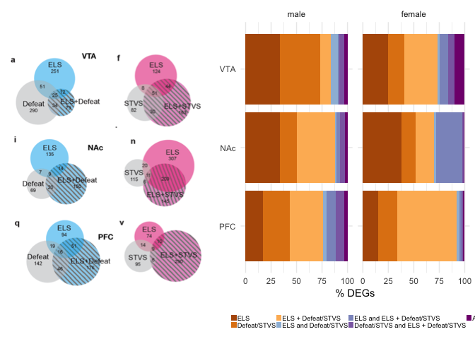

Click the button to launch a Binder R session and tinker with all the
bar plots or explore the code in the cloud. Navigate to the `examples`
directory where there is a subdirectory for each of the four examples,
all identified by the first or last author.

[Venn diagrams](https://en.wikipedia.org/wiki/Venn_diagram) are a type
of figure that I see a lot in the literature. While Venn diagrams are a
great way to *conceptualize* the goal of looking for shared or unique
transcriptional responses to experimental manipulations, I don’t think
they are the best way to *vizualize empirical data*.

I searched for “Venn” in Garrett Grolemund & Hadley Wickham’s [R for
Data Science](https://r4ds.had.co.nz/) book and in Claus Wilke’s
[Fundamentals of Data Visualization](https://serialmentor.com/dataviz/)
book, for guidance alternatives to the Venn diagram. Neither book
discusses Venn diagrams, but they both provide valuable insight into
creating bar plots. Interestingly, the R for Data Science book does use
Venn diagrams to illustrate the differences between `inner_join` and
`full_join`, so that provides some evidence that Venn diagrams are
useful for conceptualizing ideas about data.)

The [UpSet plot](https://www.ncbi.nlm.nih.gov/pmc/articles/PMC4720993/)
has gained some popularity since 2016. I’ve made a handful of UpSet
plots with [`upsetR`](https://github.com/hms-dbmi/UpSetR). While it is
possible to modify the aesthetics of an UpSet plot, it is very
challenging to manipulate the size, shape, colors, and font to the
degree that is needed to combine many plots into one multi-panel figure
for a manuscript.

In this repository, I turn 12 Venn diagrams from published research
articles to four bar plots made with `tidyverse` and `cowplot`. I think
these bar plots can be made more simplicity, flexibility, reliability,
and reproducibility than a Venn diagram.

Let me know what you think!

**Example 1** is inspired by “Cognitive specialization for learning
faces is associated with shifts in the brain transcriptome of a social
wasp”" by [Berens *et al*.
2017](http://jeb.biologists.org/content/220/12/2149).

-   [Source .Rmd code](./examples/toth2017/toth-venn.Rmd)
-   [Markdown output](./examples/toth2017/toth-venn.md)

**Example 2** is from “Transcriptomics of an extended phenotype:
parasite manipulation of wasp social behaviour shifts expression of
caste-related genes”" by [Geffre *et
al*](https://royalsocietypublishing.org/doi/full/10.1098/rspb.2017.0029?url_ver=Z39.88-2003&rfr_id=ori:rid:crossref.org&rfr_dat=cr_pub%3dpubmed).

-   [Source .Rmd code](./examples/geffre2017/geffre-venn.Rmd)
-   [Markdown output](./examples/geffre2017/geffre-venn.md)

**Example 3** is from “Sex-biased transcriptomic response of the
reproductive axis to stress”" by [Calisi *et al*
2017](https://www.sciencedirect.com/science/article/pii/S0018506X17302696?via%3Dihub).

-   [Source .Rmd code](./examples/geffre2017/calisi-venn.Rmd)
-   [Markdown output](./examples/calisi2017/calisi-venn.md)

**Example 4** is from “Early life stress alters transcriptomic
patterning across reward circuitry in male and female mice”" by [Peña
*et al.* 2017](https://www.biorxiv.org/content/10.1101/624353v1).

-   [Source .Rmd code](./examples/pena2017/pena-venn.Rmd)
-   [Markdown output](./examples/pena2017/pena-venn.md)

So, that’s my comparison of four Venn diagrams and four possible bar
plot alternatives. What do you think? Do you see the advantages? What
other alternatives do you suggest? Comments welcome!
