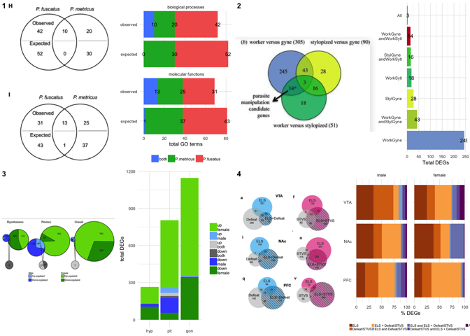

Click the button to launch a Binder R session and tinker with all the
bar plots or explore the code in the cloud.

I would like to see more scientists using bar charts instead of Venn
diagrams. I’d like to illustrate why that is by comparing venn diagrams
from some research artilces that I resprect to bar plots that I made
with `tidyverse` and `cowplot`. I think these bar plots can be made more
simplicity, flexibility, reliability, and reproducibility than a venn
diaram.

Example 1 is from [Cognitive specialization for learning faces is
associated with shifts in the brain transcriptome of a social wasp by
Berens et al.](http://jeb.biologists.org/content/220/12/2149). In this
example, the circles do not represent a meaningful quantity. A stacked
bar plot can use color, space, and text to highlight patterns in the
data. A table is another possible and easily reproducible alternative.
[Here is the code](./examples/toth2017/toth-venn.md) for my bar plot
alternative.

Example 2 if from [Sex-biased transcriptomic response of the
reproductive axis to stress by Calisi et
al.](https://www.sciencedirect.com/science/article/pii/S0018506X17302696?via%3Dihub).
The code for my bar plot alternative [is
here](./examples/calisi2017/calisi-venn.md). This weighted Venn diagram
is the highest quality Venn diagram I’ve ever seen. Here, the circles
convey meaning at large sizes, but they lose resolution at smaller
values. I think bar plots can convey the data more accurately. This
faceted and stacked bar plot really highlights the magnitude of the sex
difference between males and females.

Example 3 if from [Transcriptomics of an extended phenotype: parasite
manipulation of wasp social behaviour shifts expression of caste-related
genes by Geffre et
al.](https://royalsocietypublishing.org/doi/full/10.1098/rspb.2017.0029?url_ver=Z39.88-2003&rfr_id=ori:rid:crossref.org&rfr_dat=cr_pub%3dpubmed)
Again, these circles do not represent the data. This is a simple bar
chart without any fancy facetting or stacking. I flipped the coordinates
rather than rotating the text. The authors used an arrow, but I used a
bright red fill to highly the candidate genes. [Here is the
code](./examples/geffre2017/geffre-venn.md) for my bar plot alternative.

Example 4 from [Early life stress alters transcriptomic patterning
across reward circuitry in male and female
mice](https://www.biorxiv.org/content/10.1101/624353v1) by Catherine
Jensen Peña *et al.* This might be my favorite. The subplot has its own
scaling, so of circles cannot be compared across plots. Moreover, the
authors report the per cent of shared gene expression, which venn
diagrams shos counts. So, I calculated the per cent. Shared gene
expression patterns are shown in purple; unique gene expression in
orange. Now, you can spot unusual trends in the data, like increase
response to early and late life stress in the female PFC. This is
something that is hidden in the Venn Diagram. [Here is the
code](./examples/pena2019/pena-venn.md) for my bar plot alternative.

What do you think? What other alternatives do you suggest?
