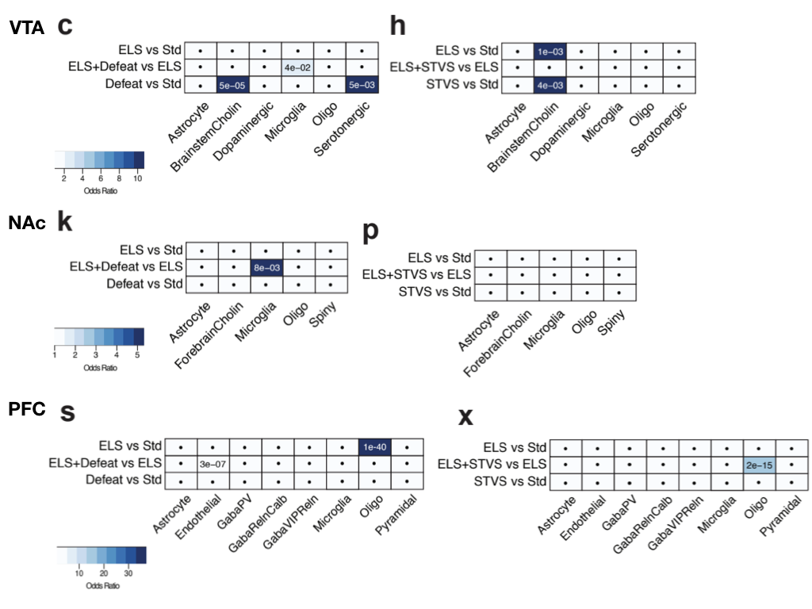
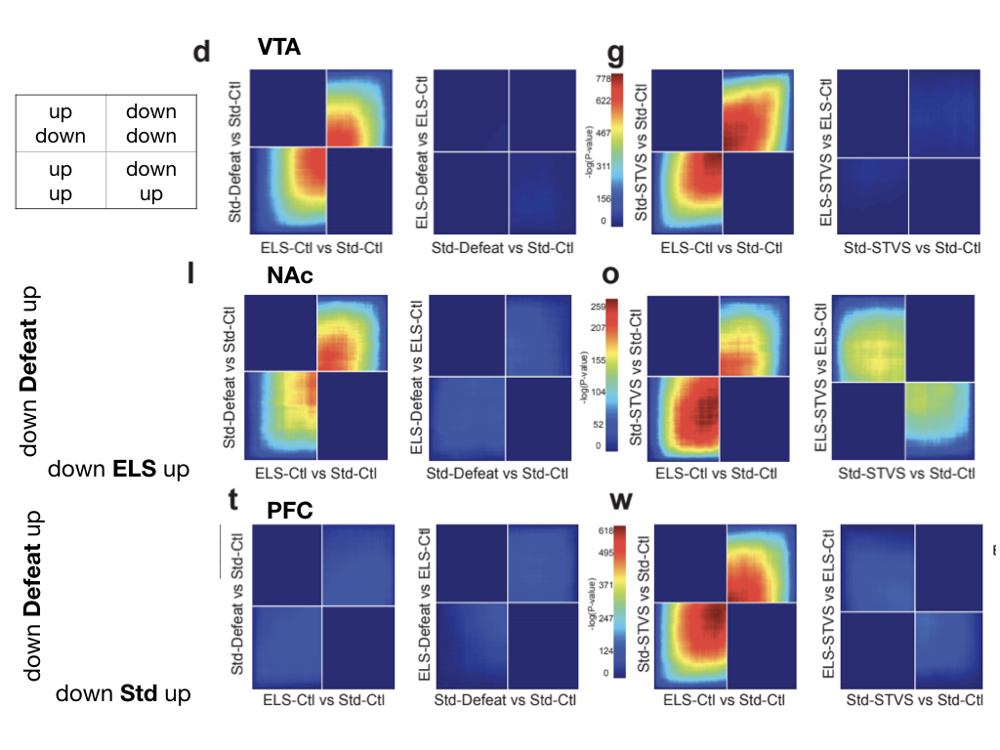

A Preprint review: Early life stress alters transcriptomic patterning across reward circuitry in male and female mice, CJ Penña et al. 2019
===========================================================================================================================================

why review a preprint?
----------------------

I saw [this paper](https://www.biorxiv.org/content/10.1101/624353v1) on
Twitter and decided to take a closer look. One of my (unpublished)
thesis chapters explores an RNA-seq dataset with four behavioral
treatment groups and 3 brain regions. My postdoc research also uses
datasets with mutliple beahvioral groups, 3 brain regions, and does so
in males and females. So, while I may not have a publication record that
refelts my expertise in this area, I’m quite familiar with the
challenges of complex RNA-seq designs for beahivoral neuroscience
research. I’ve read and presented a lot of preprints in journal club,
but I’ve enver formally reviewed one, so I thought I would let this one
be my first attempt!

The Iintroduction
-----------------

Before I start reviewing a paper, I always consult [PLOS’s how to review
a paper
video](https://reviewers.plos.org/resources/how-to-review-a-manuscript/).
PLOS suggests that I start by reading the introdcution. I use read Adobe
Acrobat Pro’s read out loud feature to listen to the introduction while
I make spegetti. This worked quite well! It was easy to follow and
understand.

Data availablility
------------------

Without reading the methods or results, I went looking for public access
to the data; I searched for Gene Expression Omnibus (GEO) accession
numbers and found two:

-   [GSE89757](https://www.ncbi.nlm.nih.gov/geo/query/acc.cgi?acc=GSE89757)
    is associated with [Smith *et al.*
    2016](http://www.eneuro.org/content/3/6/ENEURO.0240-16.2016)
    “Integrative Analysis of Disease Signatures Shows Inflammation
    Disrupts Juvenile Experience-Dependent Cortical Plasticity”. This
    particular data set is used for the analysis associated with Fig. 6.

-   [GSE89692](https://www.ncbi.nlm.nih.gov/geo/query/acc.cgi?acc=GSE89692)
    is associated with [Penña *at el.*
    2017](https://science.sciencemag.org/content/356/6343/1185.long)
    “Early life stress confers lifelong stress susceptibility in mice
    via ventral tegmental area OTX2”. The published *Science* paper
    focuses on **males only**, but the data for **both females and
    females** are archieved here.

Next, I went to [BioJupies](https://amp.pharm.mssm.edu/biojupies/) to
see if I could quickly get a report of differentially gene expression.
It didn’t work on the first data set for some reason, but it did work
for
[GSE89692](https://www.ncbi.nlm.nih.gov/geo/query/acc.cgi?acc=GSE89692).
BioJupies only lets you compare two groups: control and perterbed. The
GEO accession has nearly 200 samples, but only about a dozen are
imported into BioJupies. I can’t tell what’s what sex or what brain
region the samples are from, but I can see the 4 treatment groups I’m
limited to a single comparison in BioJupies, so I compare ELS-ctl and
ELS-STVS to look at the effect of adult stressors in all mice that were
subjected to early life stressors. [You can view the notebook
here](https://amp.pharm.mssm.edu/biojupies/notebook/Ptbvkbvay).

figures
-------

**Figure 1:** Overall its a very clear, readable, interpretable figure.
I like use of white/dark, no-stripes/stripes for showing the 2x2 design
comparing control/stress and early-/late-life. I also like how this
paper uses pink as the color to distinguish it from the blue color used
in the 2017 study on males only. (Okay, I don’t love the use of
blue/pink as gender sterotypes, but it does effectively communicate sex
differences :woman\_shrugging:.) I do like the stats indicators and how
subplots j and l provide a quick comparison of males and females. I do
wonder why y’all chose to use bar plots with point instead of boxplots
with or without points….

**Figure 2:** This figure is very complex. It’s the one that I wanted to
[read on my
phone](https://twitter.com/raynamharris/status/1124463113430913025), but
the text was too small. Without zooming in, only the top portions with
the venn diagrams and heatmaps are readable. The tables and
hypergeometric plots are not readable. Also, none of the color-gradient
legends are readbale. Even though I applaud the aurthors attempts to
show all the data in various ways in one figure, I think a little less
quantity would improve the quality. So, let me report on each part of
figure 2.

**Figure 2 venn diagrams:** At first glance, I like the venn diagrams
because they do a nice job of conveying shared responses to stressors
treatment. However, on closer inspection I noticed that the scaling is
not consistent across all 6 venn diagrams, so you can’t rely on size of
the circle to compare across sexes or brain regions. [UpSet
plots](https://github.com/hms-dbmi/UpSetR) that show bar graphs of
intersectional data are increasingly popular; however they are easily to
manipuate in terms of font size and bar color. I have been experimenting
with bar plots to show the same data. The second image below show a bar
graph version of the same data, transcripted from the text within the
figure to the best of my ability. Colors for the bars were chosen by
uploaded screen shots of the male and female venns and generating hex
codes from
<a href="https://imagecolorpicker.com/" class="uri">https://imagecolorpicker.com/</a>.
I use “AS” to stands “adult stress” which encompaseses “Defeat” and
“STVS”.

I like the above bar plot because it lets me compare DEGs across sexs
and brain regions. I see the largest responses in the VTA of males and
the NAc of females. The PFC is most responsive to early and late stress
combined, with little overlap to the other treatments. But, what do the
results say when referencing the venn diagrams?

*There was 1-23% overlap in DEGs across the three stress conditions (ELS
or STVS/Defeat or ELS+STVS/Defeat) in male and female VTA, male NAc, and
male and female PFC (Figure 2a, f, i, q, v), and more than 50% overlap
in female NAc, compared to a standard-reared control with no adult
stress (Std-Ctl; Figure 2n).*

Hmm. This doesn’t say another about, but quotes thresholds for percent
overlap. I’m not really sure what they mean by overlap. I *assume* it
means the shaded regions of the venn diagrams, but I am not certain. To
confirm results, I had to caluculate percentage of overlap rather than
plot total number of genes. I made a color palete where orange shades
represent unique and purples reprsented shared (aka overlappping) gene
expression responses. First I calculate the percent as a function of the
sum total of DEGs. This does not relate to the results, but I do think
it provides a nice alternative to venn diagrams. After than, I
calculated percent of DEGs for each group and then plotted the
percentage, adding lines for 23 and 50%, which were noted in the
manuscript. I don’t think this figure aggrees with the stated results. I
see the female VTA and NAc and the male PFC as having greater than 25%
DEGs shared between one or more stress groups, which the other three
show &lt; 25%. I do see that in the female NAc, 50% of the genes are
unique to either ELS or AS alone. Maybe this is what those results refer
to…

**Figure 2 heat maps:** I don’t often see two heatmaps with different
clustering approaches shown side by side, but I like this. I’m more used
to seeing the one’s on the bottom that are clustered by correlation, but
I like the addtional infromation gained by the “union” type. However, I
can’t help but wonder a) why the authors chose to show group averages
rather than showing the data for all the samples. Also, why don’t the
authors provide a heatmap that shows how all the samples compare to one
another? Do samples cluster mostly by brain region, sex, early-life
stress or late-life stress? These are questions that could be easily
deomonstrated with a supplementary heatmap or PCA plot or MDS plot in
the supplemental material.

**Figure 2 tables:** Figure 2 has some tables-like subplots. I combine
them for easy viewing and immediately wonder are the female tables
shaded blue not pink. From this data, the authors infer that neither
ELS, adult stress, or a combination of stresses induced cell
type-specific transcriptional changes. From what they present, I concur.
I like seeing the author’s use cell-type specific markers to validate or
explore cell-specific patterns. A revierwed ask me to do this recently,
and I think really improved that manuscript (see [the
preprint](https://www.biorxiv.org/content/10.1101/153585v3)). My only
concern with this is that I was provided any of the raw data in the
methods or figures, so all I have to go on are reported p-values and
odds ratios. What genes were used as markers? We they all expressed? How
many were significant?

**Figure 2 hypergeometric plots:** These are really cool and agree with
the results. I do think is easier to compare the results to the figure
if you position them closer in space. Like this. Also, the figure legend
does a great job of explaining each quadrant, but I find that the exes
within the figures are hard to read.

conflicts of interest
---------------------

I’ve heard of the the [Eric
Nestler](https://en.wikipedia.org/wiki/Eric_J._Nestler), but I don’t
personally know any other the authors. I don’t share any co-authors with
Catherine Peña, but we both do follow 38 of the same people on Twitter
