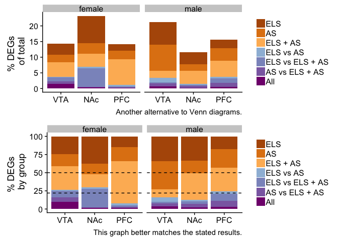

Figure 2 of Peña el al has 6 venn diagrams that are not uniformally
scales. So, one cannnot easily compare across groups. I have been
experimenting with bar plots to show the same data. The second image
below show a bar graph version of the same data, transcripted from the
text within the figure to the best of my ability. Colors for the bars
were chosen by uploaded screen shots of the male and female venns and
generating hex codes from
<a href="https://imagecolorpicker.com/" class="uri">https://imagecolorpicker.com/</a>.

Hmm. Is a venn diagram or the above bar plot what they should use given
what they report in the results?

*There was 1-23% overlap in DEGs across the three stress conditions (ELS
or STVS/Defeat or ELS+STVS/Defeat) in male and female VTA, male NAc, and
male and female PFC (Figure 2a, f, i, q, v), and more than 50% overlap
in female NAc, compared to a standard-reared control with no adult
stress (Std-Ctl; Figure 2n).*

